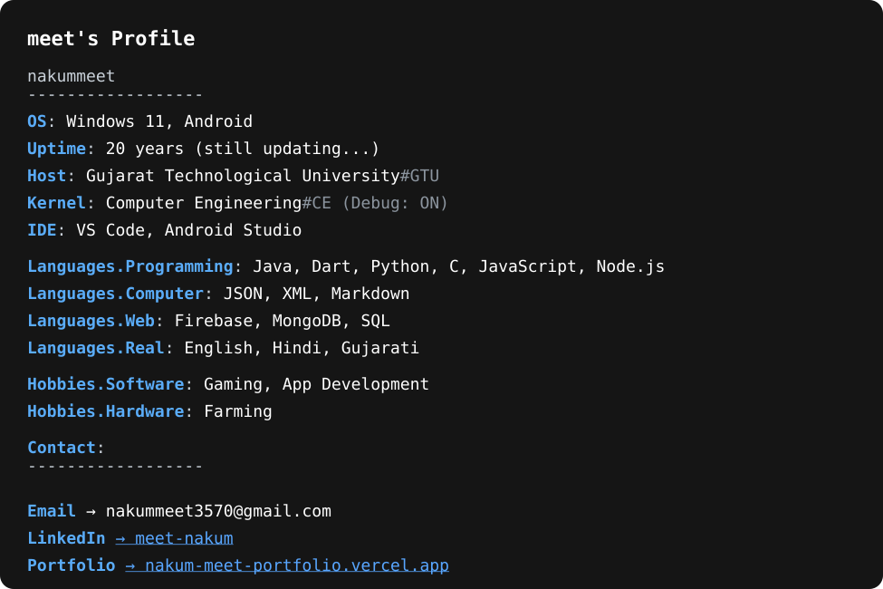

[](https://git.io/typing-svg)

---

<div align="center">
  <a href="https://github.com/nakummeet">
    
  </a>
</div>

<br/>

## 🧑‍💻 About Me

```bash
┌──(meet㉿nakum)-[~/portfolio]
└─$ whoami
```

```json
{
  "name"      : "Meet Nakum",
  "role"      : "Flutter & Node.js Developer",
  "available" : true,
  "building"  : ["SweetBite 🍰", "LocalBites Backend 🍔"],
  "fun_facts" : ["console.log debugger 😄", "Coffee-driven dev ☕", "Dark mode only 🌙"]
}
```

```bash
┌──(meet㉿nakum)-[~/portfolio]
└─$ _
```

---

## 🛠️ Tech Stack

<div align="center">


</div>

---

## 📊 GitHub Stats

<p align="center">
  
  
</p>

<p align="center">
  
</p>

<p align="center">
  
</p>

---

## 🚀 Featured Projects

<div align="center">
  <a href="https://github.com/nakummeet/SweetBite">
    
  </a>
  <a href="https://github.com/nakummeet/DE-exercise-">
    
  </a>
  <a href="https://github.com/nakummeet/localbites-backend">
    
  </a>
  <a href="https://github.com/nakummeet/de-backend-exercise-app-">
    
  </a>
</div>

---

## 📈 Contribution Chart

<p align="center">
  
</p>

---

## 🔗 Connect With Me

<div align="center">

[](https://nakum-meet-portfolio.vercel.app/)
[](https://www.linkedin.com/in/meet-nakum-95730a344)
[](https://www.instagram.com/me_et_nakum)
[](https://github.com/nakummeet)

</div>

---

<div align="center">

### 💙 Thanks for stopping by — happy coding!


</div>

