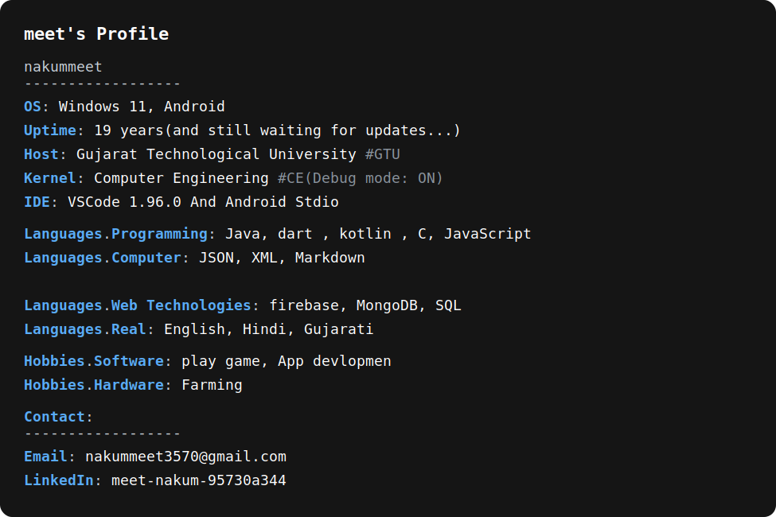

  <a href="https://github.com/nakummeet">
    <picture>
      <source media="(prefers-color-scheme: dark)" srcset="./information.svg">
      
    </picture>
  </a>

  <h2 align="center" style="color: #00add8;">GitHub Activity Graph</h2>
  

    
  

  

    <a href="https://github.com/nakummeet">
      
    <a href="https://github.com/nakummeet">
      
  

  

    <a href="https://github.com/nakummeet">
      
  

  

    <a href="https://github.com/nakummeet">
      
  

  

     
    
<b>Visitors Count</b>
  
    

 
     
  

  <h2 align="center" style="color: #00add8;">Top Repositories</h2>
  

    <table>
      <tr>
        <td>
          
        </td>
        <td>
          
        </td>
      </tr>
    </table>
  

  <h2 align="center" style="color: #00add8;">GitHub Contribution Chart</h2>
  

    
  

  <h1 align="center" style="color: #00add8;">Thanks for visiting my profile.</h1>
  

